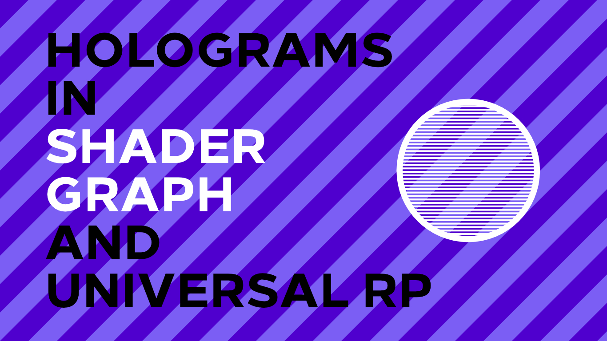

# Holograms in Unity URP

A holographic Shader Graph for Unity Universal Render Pipeline.

## Overview

This project contains a shader graph for creating holographic objects. It uses a fresnel around the outer edge of the object, with a scanline texture projected over the object on the global y-axis, moving slowly downwards. An accompanying tutorial is available on [danielilett.com](https://danielilett.com/2020-07-12-tut5-9-urp-hologram/).

## Software

This project was created using Unity 2019.4.0f1 and Universal Render Pipeline 7.3.1.

## Authors

This project and the corresponding tutorial series were written by Daniel Ilett. [Follow him on Twitter](https://twitter.com/daniel_ilett) for more gamedev tutorials!

## Release

This project was released on July 12th 2020.
